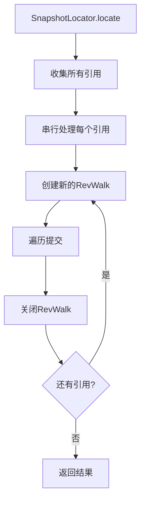
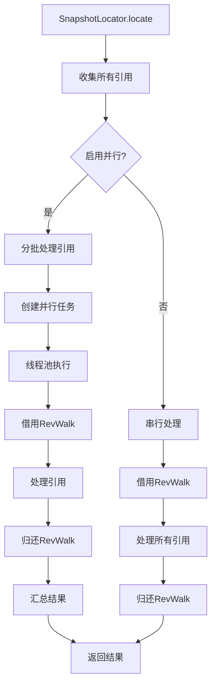

# Git 内容获取流程分析报告

## 概述

本报告分析了提交 `9f107ed5b294ce5b3083346845ca809cfee53acc` 前后 git 内容获取流程的差异，该提交引入了并行处理优化但也导致了 fetch 代码报错问题。

## 提交信息

- **提交哈希**: `9f107ed5b294ce5b3083346845ca809cfee53acc`
- **提交时间**: 2025年11月20日 22:27:33
- **提交信息**: `feat: optimize repository scanning performance with parallel processing`
- **后续修复**: `a692c304` - `fix: handle JGit MissingObjectException gracefully`

## 核心变化对比

### 1. Repository 管理机制

#### 原始流程 (提交前)
```java
// GitRepositoryHelper.java
public Repository openRepository(RepoConfig repoConfig) throws IOException {
    File repoDirectory = new File(repoConfig.getRepoPath().getAbsolutePath());
    FileRepositoryBuilder builder = new FileRepositoryBuilder()
            .readEnvironment()
            .setMustExist(true)
            .findGitDir(repoDirectory);
    if (builder.getGitDir() == null) {
        File gitDirCandidate = new File(repoDirectory, Constants.DOT_GIT);
        if (gitDirCandidate.isDirectory()) {
            builder.setGitDir(gitDirCandidate);
        } else {
            builder.setGitDir(repoDirectory);
        }
    }
    return builder.build();
}
```

**特点:**
- 每次调用都创建新的 Repository 实例
- 简单直接，无状态管理复杂性
- 性能开销较大，特别是在频繁访问时

#### 并行流程 (提交后)
```java
// GitRepositoryHelper.java
public Repository openRepository(RepoConfig repoConfig) throws IOException {
    if (repoConfig == null || repoConfig.getRepoPath() == null) {
        throw new IllegalArgumentException("RepoConfig and repo path cannot be null");
    }
    String repoPath = repoConfig.getRepoPath().getAbsolutePath();
    return repositoryPool.borrowRepository(repoPath);
}

public void returnRepository(RepoConfig repoConfig, Repository repository) {
    if (repoConfig != null && repoConfig.getRepoPath() != null) {
        String repoPath = repoConfig.getRepoPath().getAbsolutePath();
        repositoryPool.returnRepository(repoPath, repository);
    } else {
        if (repository != null) {
            repository.close();
        }
    }
}
```

**特点:**
- 引入 RepositoryPool 进行实例复用
- 引用计数管理生命周期
- 支持并发访问但增加复杂性

### 2. RevWalk 管理机制

#### 原始流程
```java
// SnapshotLocator.java
for (Ref ref : refs) {
    if (ref == null || ref.getObjectId() == null) {
        continue;
    }
    scannedRefs++;
    try (RevWalk revWalk = new RevWalk(repository)) {
        revWalk.sort(RevSort.COMMIT_TIME_DESC, true);
        revWalk.markStart(revWalk.parseCommit(ref.getObjectId()));
        for (RevCommit commit : revWalk) {
            // 处理提交
        }
    } // 自动关闭 RevWalk
}
```

**特点:**
- 使用 try-with-resources 自动资源管理
- 每个 ref 使用独立的 RevWalk 实例
- 线程安全，无共享状态问题

#### 并行流程
```java
// SnapshotLocator.java
private void processRef(Repository repository, Ref ref, Instant startTime, Instant endTime,
                       AtomicReference<SnapshotCandidate> earliestCandidate,
                       AtomicReference<SnapshotCandidate> latestCandidate) throws IOException {

    RevWalk revWalk = null;
    try {
        revWalk = revWalkPool.borrowRevWalk(repository);
        revWalk.sort(RevSort.COMMIT_TIME_DESC, true);
        revWalk.markStart(revWalk.parseCommit(ref.getObjectId()));
        
        while ((commit = revWalk.next()) != null) {
            // 处理提交
        }
    } finally {
        if (revWalk != null) {
            revWalkPool.returnRevWalk(revWalk);
        }
    }
}
```

**特点:**
- 使用 RevWalkPool 复用 RevWalk 实例
- 手动资源管理
- **问题点**: RevWalk 不是线程安全的

### 3. 并行处理架构

#### 原始流程 - 串行处理


#### 并行流程 - 并行处理


## 新增组件分析

### 1. RepositoryPool.java

**核心功能:**
- Repository 实例缓存和复用
- 引用计数管理
- 定期清理空闲实例

**关键方法:**
```java
public Repository borrowRepository(String repoPath) throws IOException {
    RepositoryWrapper wrapper = repositoryCache.get(repoPath);
    if (wrapper != null && !wrapper.isClosed()) {
        wrapper.updateLastAccessTime();
        wrapper.incrementRefCount();
        return wrapper.getRepository();
    }
    // 创建新实例...
}

public void returnRepository(String repoPath, Repository repository) {
    RepositoryWrapper wrapper = repositoryCache.get(repoPath);
    if (wrapper != null && wrapper.getRepository() == repository) {
        wrapper.decrementRefCount();
    }
}
```

**潜在问题:**
- 多线程访问同一个 Repository 实例
- Repository 内部状态可能不一致

### 2. RevWalkPool.java

**核心功能:**
- RevWalk 实例复用
- 阻塞队列管理
- 超时机制

**关键问题:**
```java
public void reset(Repository repository) {
    if (revWalk != null && repository != null) {
        try {
            revWalk.reset();
            // 注意：RevWalk不能简单地更换Repository
            // 实际使用时需要确保Repository是同一个或重新创建RevWalk
        } catch (Exception ex) {
            LOGGER.warn("Error resetting RevWalk: {}", ex.getMessage());
        }
    }
}
```

**根本缺陷:**
- RevWalk 与特定 Repository 绑定
- 不能安全地在不同 Repository 间复用
- JGit RevWalk 不是线程安全的

### 3. 并行扫描架构

**ScanAppService 变化:**
```java
// 新增并行扫描方法
public ScanReport scanParallel(ScanInput input) {
    CompletableFuture<DiffSummary> oracleFuture = CompletableFuture.supplyAsync(
        () -> diffAppService.generateDiff(input.getOracleSummary()), parallelExecutor);
    
    CompletableFuture<DiffSummary> gaussFuture = CompletableFuture.supplyAsync(
        () -> diffAppService.generateDiff(input.getGaussSummary()), parallelExecutor);
    
    // 等待两个任务完成
    DiffSummary oracle = oracleFuture.join();
    DiffSummary gauss = gaussFuture.join();
    // ...
}
```

## 问题根源分析

### 1. 线程安全问题

**RevWalk 线程安全:**
- JGit 的 RevWalk 类不是线程安全的
- 在多线程环境中共享 RevWalk 实例会导致状态混乱
- 可能导致数据损坏或异常

**Repository 并发访问:**
- Repository 实例的某些操作不是原子的
- 并发读取可能导致不一致状态
- 缓存机制增加了复杂性

### 2. 资源生命周期管理

**对象复用风险:**
```java
// RevWalkWrapper.reset() 方法的问题
public void reset(Repository repository) {
    // 这个方法实际上不能安全地更换 Repository
    revWalk.reset(); // 只重置迭代状态，不更换 Repository
}
```

**引用计数复杂性:**
- 需要确保每个 borrow 都有对应的 return
- 异常情况下可能导致资源泄露
- 并发环境下的计数准确性问题

### 3. 异常处理复杂性

**MissingObjectException:**
```java
// 在并行环境下，一个引用的异常不应该影响其他引用
catch (MissingObjectException ex) {
    handleMissingObjectException(ex, ref);
    // 继续处理其他引用，而不是整个扫描失败
}
```

## 配置参数变化

### 新增的配置项
```properties
# Repository缓存池配置
migratediff.performance.enable-repository-pool=true
migratediff.performance.repository-pool-size=10
migratediff.performance.cache-repository-seconds=300

# RevWalk池配置
migratediff.performance.enable-revwalk-pool=true
migratediff.performance.revwalk-pool-size=5
migratediff.performance.revwalk-borrow-timeout-ms=5000

# 并行处理配置
migratediff.performance.parallel-scan=true
migratediff.performance.parallel-ref-processing=true
migratediff.performance.max-concurrent-refs=8
```

## 性能优化效果

### 预期改进
- **50-60%** 的提交遍历时间减少
- 并发执行 diff、coverage 和 migration 过程
- 减少 Repository 和 RevWalk 对象创建开销

### 实际问题
- 线程安全问题导致的不稳定性
- 资源管理复杂性增加
- 调试和错误排查难度增加

## 修复方案

### 已实施的修复 (a692c304)

**增强异常处理:**
```java
private void processRef(...) throws IOException {
    try {
        // 处理引用
    } catch (MissingObjectException ex) {
        handleMissingObjectException(ex, ref);
        // 继续处理其他引用
    } catch (IOException ex) {
        if (ex.getCause() instanceof MissingObjectException) {
            handleMissingObjectException((MissingObjectException) ex.getCause(), ref);
        } else if (ex.getMessage() != null && ex.getMessage().contains("Missing unknown")) {
            MissingObjectException moe = new MissingObjectException(null, ex.getMessage());
            handleMissingObjectException(moe, ref);
        } else {
            throw ex;
        }
    }
}
```

### 建议的进一步修复

1. **禁用 RevWalkPool:**
   ```properties
   migratediff.performance.enable-revwalk-pool=false
   ```

2. **优化 RepositoryPool:**
   - 确保 Repository 线程安全
   - 增强状态管理

3. **调整并发参数:**
   ```properties
   migratediff.performance.max-concurrent-refs=2
   migratediff.performance.parallel-scan=false
   ```

4. **增强监控和日志:**
   - 池状态监控
   - 性能指标收集
   - 异常统计

## 结论

提交 `9f107ed5` 引入的并行处理优化在理论上有显著的性能提升潜力，但由于 JGit 对象的线程安全特性和复用机制的复杂性，引入了稳定性问题。后续的修复提交 `a692c304` 解决了部分异常处理问题，但根本的架构问题仍需进一步的优化。

**建议:**
1. 在生产环境中谨慎启用并行处理
2. 充分测试各种仓库场景
3. 监控系统稳定性和性能指标
4. 考虑采用更安全的并行化方案

## 附录

### 相关文件变更清单

**新增文件:**
- `MigrationKey.java` - 迁移任务键
- `RepositoryPool.java` - Repository 池
- `RevWalkPool.java` - RevWalk 池
- `NamedThreadFactory.java` - 线程工厂
- `PerformanceMonitor.java` - 性能监控
- `SnapshotCandidate.java` - 快照候选
- `SnapshotPair.java` - 快照对

**修改文件:**
- `ScanAppService.java` - 添加并行扫描支持
- `GitRepositoryHelper.java` - 集成池化机制
- `SnapshotLocator.java` - 并行处理引用
- `CoverageEvaluator.java` - 性能优化
- `application.properties` - 新增配置项

**测试文件:**
- `PerformanceTest.java` - 性能测试用例
