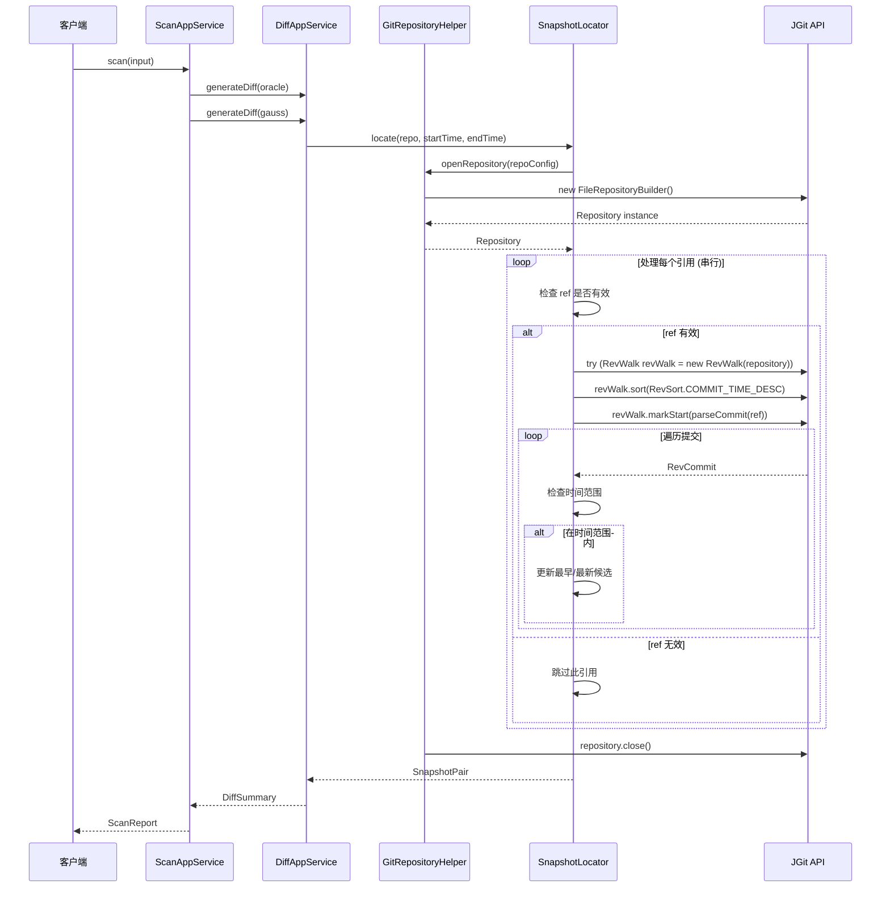
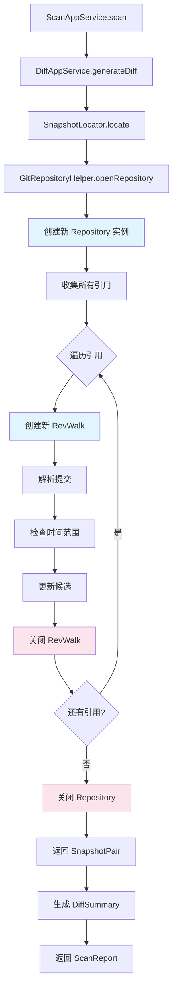
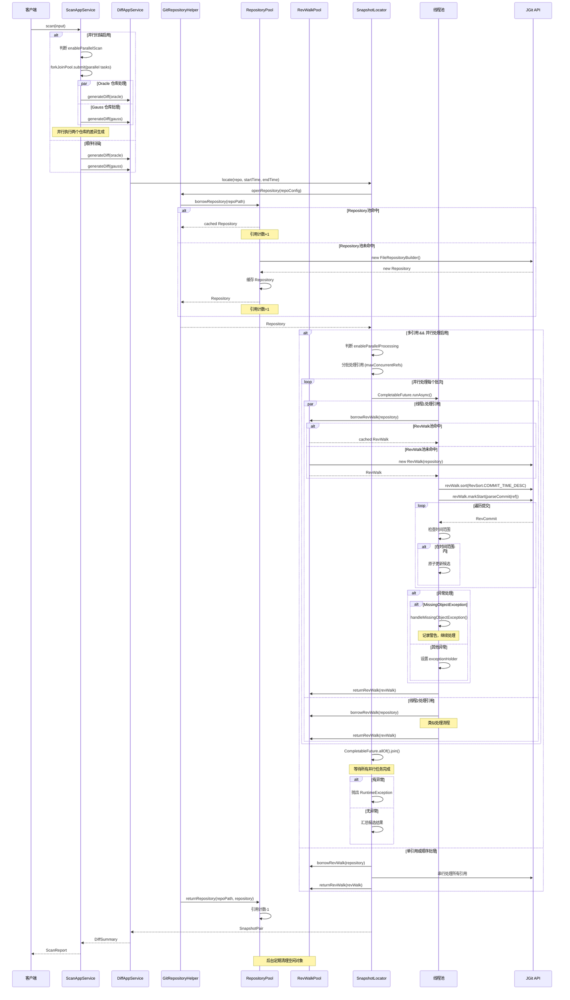
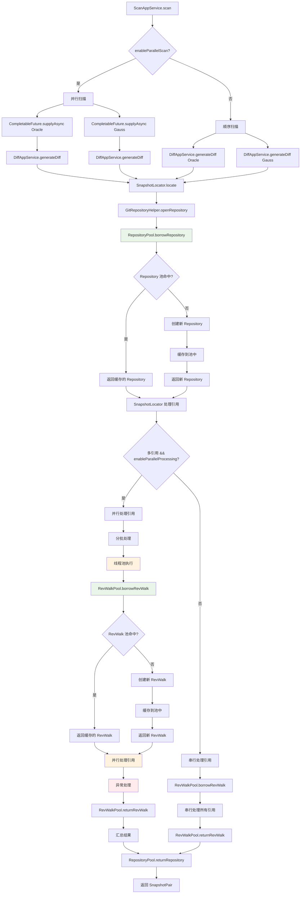
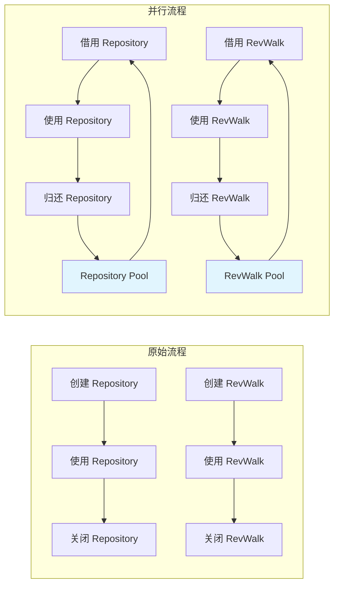
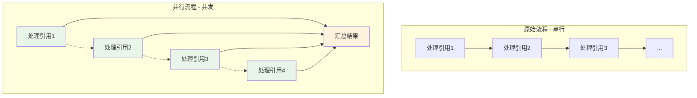
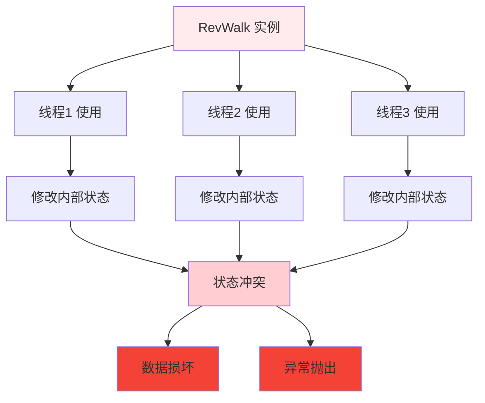
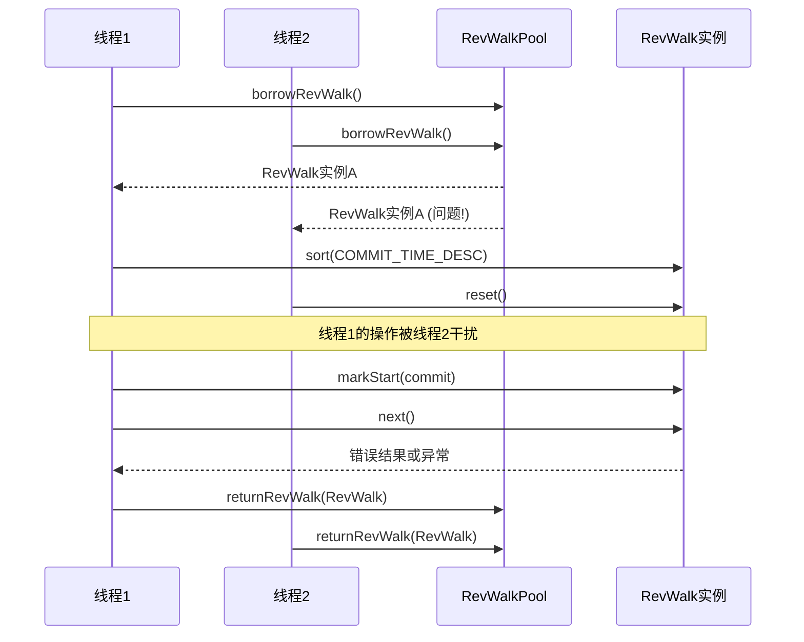
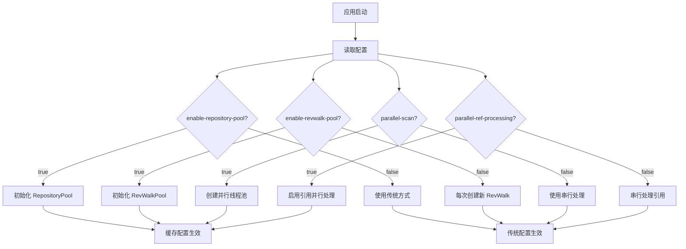

# Git 内容获取流程对比图

## 原始流程 (提交 9f107ed5 之前)

### 完整序列图

### 流程架构图

## 并行处理流程 (提交 9f107ed5 之后)

### 完整序列图

### 并行处理架构图

## 关键差异对比

### 1. 资源管理对比

### 2. 并发处理对比

## 问题点可视化

### RevWalk 线程安全问题

### 资源池竞争

## 配置影响流程图

这个可视化分析清楚地展示了提交 `9f107ed5` 引入的并行处理机制的复杂性，以及为什么会导致 fetch 代码报错。核心问题在于 JGit 对象的线程安全特性和不恰当的资源共享机制。
