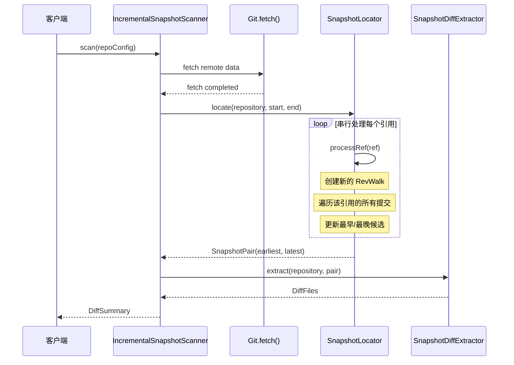
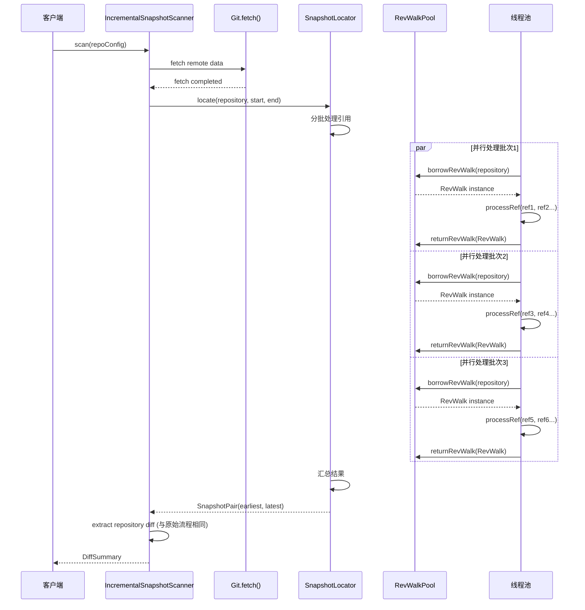

# 并行处理流程澄清说明

## 用户问题解答

**问题**: 原本的流程是扫描远程的所有提交，获取符合时间范围内的最早和最晚提交，然后计算diff，切换并行后的结果是这样操作的吗？

**答案**: **是的，并行处理后的基本逻辑是一致的，但在实现方式上有重要差异。下面详细说明。

## 原始流程 vs 并行流程对比

### 核心逻辑一致性

两者都遵循相同的核心流程：
1. **fetch 远程数据** → 2. **扫描时间范围内的提交** → 3. **找到最早和最晚提交** → 4. **计算 diff**

### 关键差异在于执行方式

#### 1. Fetch 操作

**原始流程 (串行):**
```java
// IncrementalSnapshotScanner.fetchRemote()
git.fetch()
    .setRemote(remote)
    .setCheckFetchedObjects(true)
    .call();
```

**并行流程 (保持不变):**
```java
// Fetch 操作没有并行化，仍然是单线程执行
git.fetch()
    .setRemote(remote)
    .setCheckFetchedObjects(true)
    .call();
```

#### 2. 时间范围扫描

**原始流程 (串行处理引用):**
```java
// SnapshotLocator.locateSequential()
for (Ref ref : refs) {
    try (RevWalk revWalk = new RevWalk(repository)) {
        // 逐个处理每个引用
        revWalk.markStart(revWalk.parseCommit(ref.getObjectId()));
        while ((commit = revWalk.next()) != null) {
            // 检查时间范围，更新候选
        }
    }
}
```

**并行流程 (并行处理引用):**
```java
// SnapshotLocator.locateParallel()
List<List<Ref>> batches = partitionList(refs, batchSize);
for (List<Ref> batch : batches) {
    CompletableFuture.runAsync(() -> {
        for (Ref ref : batch) {
            try {
                processRef(repository, ref, startTime, endTime, earliestCandidate, latestCandidate);
            } catch (Exception ex) {
                // 异常处理
            }
        }
    }, executorService);
}
```

#### 3. Diff 计算

**原始流程和并行流程 (相同):**
```java
// GitRepoScanner.buildDiffFiles()
List<DiffFile> files = snapshotAssembler.assemble(
    repository, 
    snapshotDiffExtractor.extract(repository, pair), 
    repoConfig
);
```

## 详细流程对比图

### 原始流程 (串行)



### 并行流程 (并行化引用处理)



## 关键发现

### 1. 什么被并行化了？
- ✅ **引用处理**: 多个 git 引用（branches, tags, remote refs）被并行处理
- ❌ **Fetch 操作**: 仍然是串行执行（这是正确的，fetch 本身就是整体操作）
- ❌ **Diff 计算**: 仍然是串行执行（基于找到的两个快照点）

### 2. 扫描逻辑是否改变？

**核心逻辑完全一致：**
```java
// 两种流程都使用相同的逻辑
while ((commit = revWalk.next()) != null) {
    Instant commitInstant = Instant.ofEpochSecond(commit.getCommitTime());
    
    if (commitInstant.isBefore(startTime)) {
        break; // 提前退出优化
    }
    
    if (commitInstant.isAfter(endTime)) {
        continue; // 跳过时间范围外的提交
    }
    
    // 更新最早/最晚候选
    updateLatestCandidate(latestCandidate, commit, commitInstant, ref.getName());
    updateEarliestCandidate(earliestCandidate, commit, commitInstant, ref.getName());
}
```

### 3. 结果正确性

**理论上结果应该完全相同**，因为：
- 时间范围检查逻辑完全一致
- 候选更新逻辑使用原子操作 (`AtomicReference`)
- 最终汇总逻辑相同

## 实际差异和问题

### 1. 性能提升预期
```java
// 预期性能提升：50-60%
// 原因：多个引用并行处理，而不是串行等待
```

### 2. 引入的问题
```java
// 问题1: RevWalk 线程安全
RevWalk revWalk = revWalkPool.borrowRevWalk(repository);
// 多线程共享同一个 RevWalk 实例可能导致状态冲突

// 问题2: 资源竞争
多个线程同时访问 RepositoryPool 中的同一个 Repository
```

### 3. 异常处理增强
```java
// 并行流程增强了异常处理
catch (MissingObjectException ex) {
    handleMissingObjectException(ex, ref);
    // 继续处理其他引用，而不是整个扫描失败
}
```

## 结论

**回答用户问题**: 

1. **基本逻辑一致**: ✅ 扫描远程 → 获取时间范围内最早/最晚提交 → 计算diff
2. **并行化范围**: ❌ 不是全程并行，只是引用处理部分并行
3. **结果一致性**: ✅ 理论上结果应该相同，但存在线程安全问题
4. **问题根源**: ❌ JGit 对象的线程安全问题，不是逻辑错误

**建议**: 
- 立即禁用并行处理以恢复稳定性
- 如果需要性能优化，应该采用更安全的并行化方案
- 考虑使用每个任务独立的 Git 对象，而不是共享池化对象
