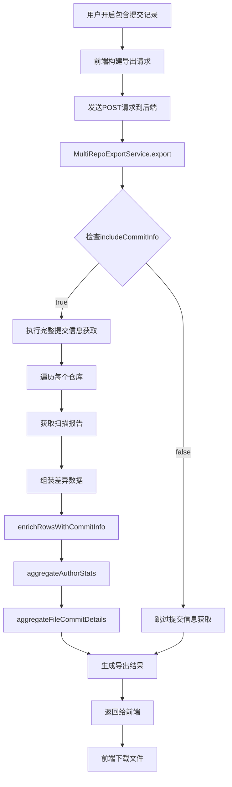
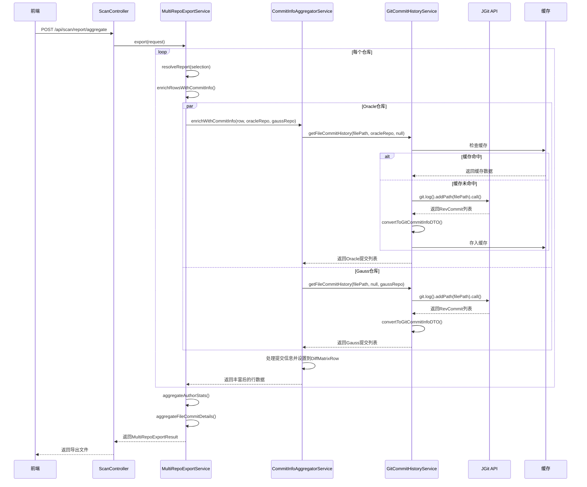
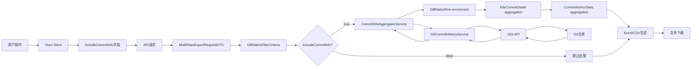
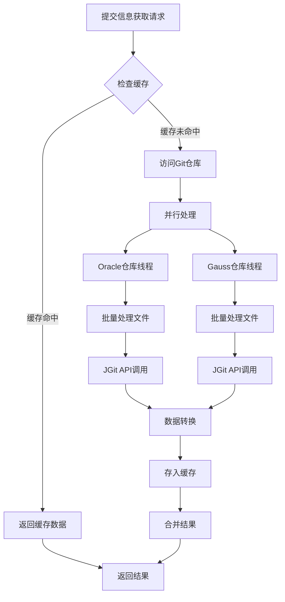
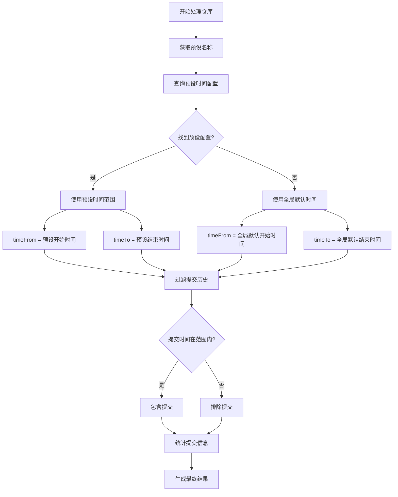
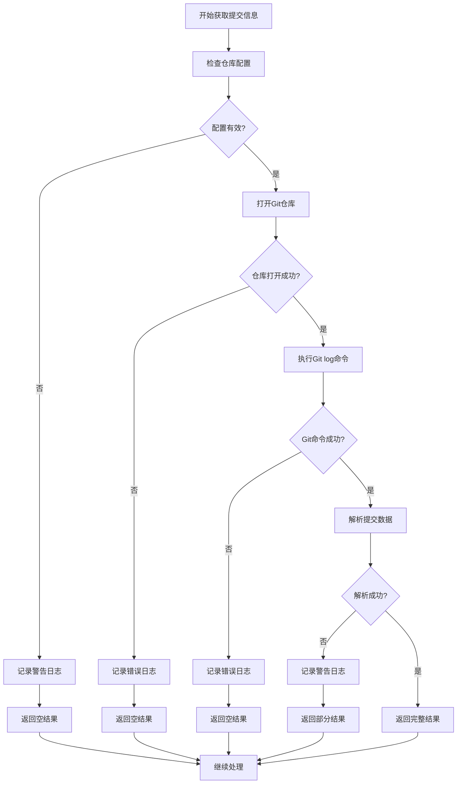
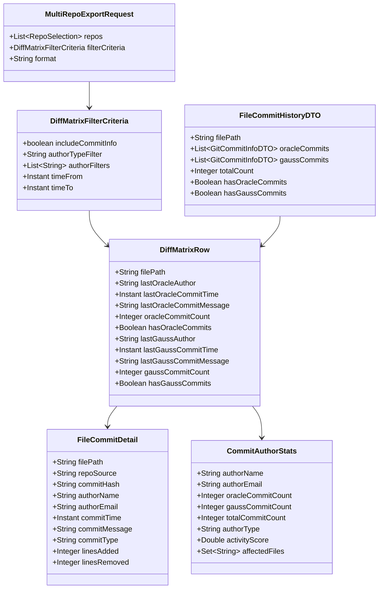
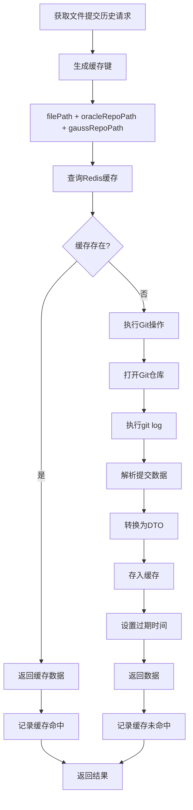

# 导出报表中提交记录获取流程图

## 1. 整体流程图

## 2. 提交信息获取详细流程

## 3. 数据流转图

## 4. 性能优化机制流程

## 5. 时间范围控制流程

## 6. 错误处理流程

## 7. 数据结构关系图

## 8. 缓存策略流程

这些流程图详细展示了导出报表中提交记录获取的完整过程，包括用户交互、后端处理、Git操作、缓存机制、错误处理等各个环节，帮助理解整个系统的工作原理和数据流向。
