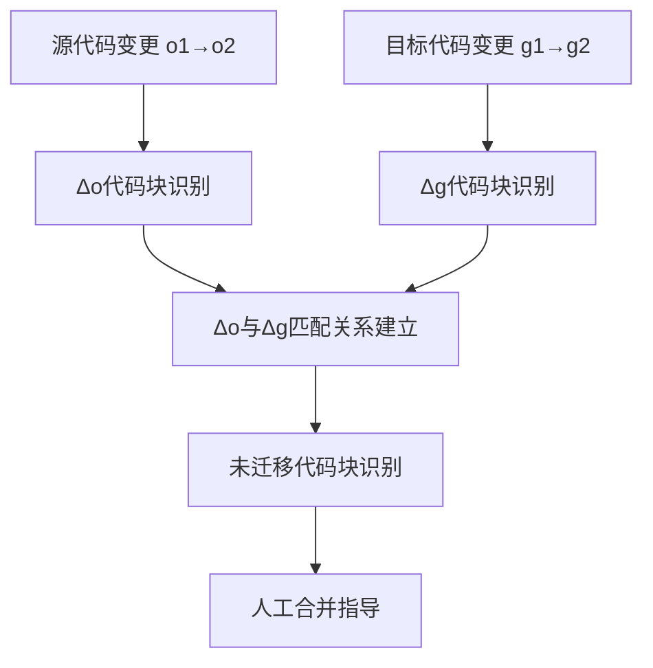
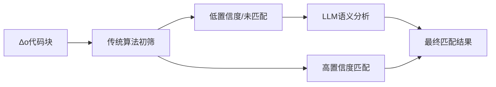

# 代码迁移匹配问题分析

## 业务背景

### 核心业务场景
在进行代码迁移项目时，需要将源代码仓库（Oracle）的变更同步到目标代码仓库（Gauss）中。具体场景如下：

- **源仓库（Oracle）**: 从版本o1升级到o2，产生了增量变更Δo
- **目标仓库（Gauss）**: 从版本g1升级到g2，产生了增量变更Δg
- **迁移目标**: 确认o1→o2的所有变更内容是否已经完整迁移到g1→g2中

### 业务价值
1. **迁移完整性验证**: 确保没有遗漏任何重要功能或修复
2. **人工合并辅助**: 识别未迁移的代码块，为手动合并提供指导
3. **质量保证**: 减少迁移过程中的错误和遗漏
4. **效率提升**: 自动化识别差异，减少人工审查工作量

## 核心问题分析

### 问题分解



### 技术挑战

#### 1. 代码块匹配的复杂性
- **结构差异**: Oracle和Gauss可能存在代码结构差异
- **命名差异**: 变量名、方法名可能不同
- **逻辑等价**: 相同逻辑可能有不同实现方式
- **顺序变化**: 代码块顺序可能发生调整

#### 2. 传统匹配方法的局限性
- **基于文本匹配**: 对结构变化敏感
- **基于AST匹配**: 实现复杂，性能开销大
- **基于语义匹配**: 需要深度理解代码逻辑

## 现有解决方案分析

### 覆盖率算法的应用

#### Legacy算法
- **原理**: 基于行数加重的相似度计算
- **优势**: 计算简单，性能较好
- **局限**: 对代码结构调整敏感，容易误判

#### Strong算法
- **原理**: 基于业务特征锚点的匹配
- **优势**: 关注业务逻辑，对结构变化有一定容忍度
- **局限**: 仍依赖表面特征，无法理解深层语义

### 算法局限性分析

#### 1. 语义理解不足
```java
// Oracle中的实现
public void calculatePrice(Order order) {
    double discount = order.getCustomer().getDiscount();
    double basePrice = order.getTotal();
    order.setFinalPrice(basePrice * (1 - discount));
}

// Gauss中的实现（逻辑相同，结构不同）
public void applyDiscount(Purchase purchase) {
    Customer customer = purchase.getCustomerInfo();
    double discountRate = customer.getDiscountPercentage();
    double originalAmount = purchase.getBaseAmount();
    purchase.setFinalAmount(originalAmount * (1 - discountRate));
}
```

#### 2. 重构识别困难
- **方法提取**: 将大方法拆分为多个小方法
- **方法合并**: 将多个小方法合并为大方法
- **逻辑重组**: 相同逻辑以不同顺序实现

#### 3. 上下文依赖缺失
- **类级别变更**: 方法调用关系发生变化
- **包级别重构**: 类被移动到不同包中
- **依赖注入变化**: 依赖关系发生调整

## LLM辅助解决方案

### 解决思路

#### 1. 混合匹配策略


#### 2. LLM应用场景

##### 场景1: 语义等价性判断
- **输入**: 两个代码块的完整内容
- **输出**: 语义等价性评分和解释
- **示例**:
```
判断以下两个Java方法是否实现相同业务逻辑：

方法A（Oracle）:
[代码内容]

方法B（Gauss）:
[代码内容]

请输出：
1. 语义相似度评分（0-100）
2. 是否实现相同业务逻辑（是/否）
3. 详细解释
```

##### 场景2: 重构识别
- **输入**: 一个代码块和目标类的多个方法
- **输出**: 最匹配的方法及重构类型
- **示例**:
```
以下Oracle方法可能被重构为Gauss中的哪个方法：

Oracle方法:
[代码内容]

Gauss候选方法:
[方法列表]

请输出：
1. 最匹配的方法名
2. 重构类型（提取/合并/重组/其他）
3. 匹配置信度
4. 详细分析
```

##### 场景3: 依赖关系分析
- **输入**: 方法调用链和上下文信息
- **输出**: 依赖关系映射和变更分析
- **示例**:
```
分析以下代码块的依赖关系变化：

Oracle调用链:
[调用链信息]

Gauss调用链:
[调用链信息]

请输出：
1. 依赖关系是否保持一致
2. 发生变化的依赖关系
3. 可能的影响分析
```

### 实施方案

#### 1. 分层匹配架构

##### 第一层：快速匹配
- **目标**: 处理明显匹配的代码块
- **方法**: 传统覆盖率算法
- **阈值**: 相似度 > 85%
- **输出**: 高置信度匹配对

##### 第二层：语义匹配
- **目标**: 处理传统算法无法确定的代码块
- **方法**: LLM语义分析
- **输入**: 低相似度代码块对
- **输出**: LLM判断结果

##### 第三层：上下文分析
- **目标**: 处理复杂的重构场景
- **方法**: LLM深度分析
- **输入**: 代码块 + 上下文信息
- **输出**: 最终匹配结果

#### 2. LLM集成策略

##### API设计
```java
public interface LLMCodeMatcher {
    /**
     * 判断两个代码块的语义等价性
     */
    SemanticMatchResult checkSemanticEquivalence(CodeBlock block1, CodeBlock block2);
    
    /**
     * 在多个候选中找到最佳匹配
     */
    BestMatchResult findBestMatch(CodeBlock sourceBlock, List<CodeBlock> candidates);
    
    /**
     * 分析重构类型和影响
     */
    RefactorAnalysisResult analyzeRefactoring(CodeBlock original, CodeBlock refactored);
}
```

##### 提示词工程
- **结构化提示**: 使用JSON格式输入输出
- **上下文增强**: 提供足够的代码上下文
- **示例引导**: 提供few-shot示例提高准确性
- **置信度评估**: 要求LLM输出置信度分数

#### 3. 性能优化

##### 批量处理
- **批量API调用**: 减少网络开销
- **并行处理**: 多线程处理多个匹配任务
- **缓存机制**: 缓存LLM分析结果

##### 智能筛选
- **预筛选**: 使用传统算法过滤明显不匹配的代码块
- **优先级排序**: 优先处理重要代码块
- **渐进式处理**: 分批处理，避免超时

## 预期效果

### 准确性提升
- **召回率**: 识别更多真正匹配的代码块
- **精确率**: 减少错误匹配的情况
- **F1分数**: 整体匹配质量的平衡提升

### 效率提升
- **自动化程度**: 减少人工判断的工作量
- **处理速度**: 快速处理大量代码块
- **可扩展性**: 支持大规模代码库分析

### 用户体验改善
- **可视化展示**: 直观显示匹配结果
- **详细解释**: 提供匹配理由和置信度
- **操作指导**: 为未匹配代码块提供合并建议

## 风险与挑战

### 技术风险
- **LLM稳定性**: 依赖外部服务的稳定性
- **成本控制**: LLM API调用的成本管理
- **性能瓶颈**: 大规模处理的性能问题

### 业务风险
- **误判风险**: LLM可能产生错误判断
- **依赖风险**: 过度依赖LLM可能引入新的问题
- **维护成本**: 系统复杂度增加带来的维护成本

### 缓解措施
- **人工审核**: 关键代码块保留人工审核环节
- **多重验证**: 结合多种方法进行交叉验证
- **渐进式实施**: 分阶段引入LLM功能，逐步验证效果

## 总结

通过结合传统覆盖率算法和LLM语义分析能力，可以构建一个更加智能和准确的代码迁移匹配系统。这种混合方案既保持了传统方法的高效性，又利用了LLM的语义理解能力，能够更好地处理复杂的代码重构场景，为代码迁移提供更可靠的技术支撑。