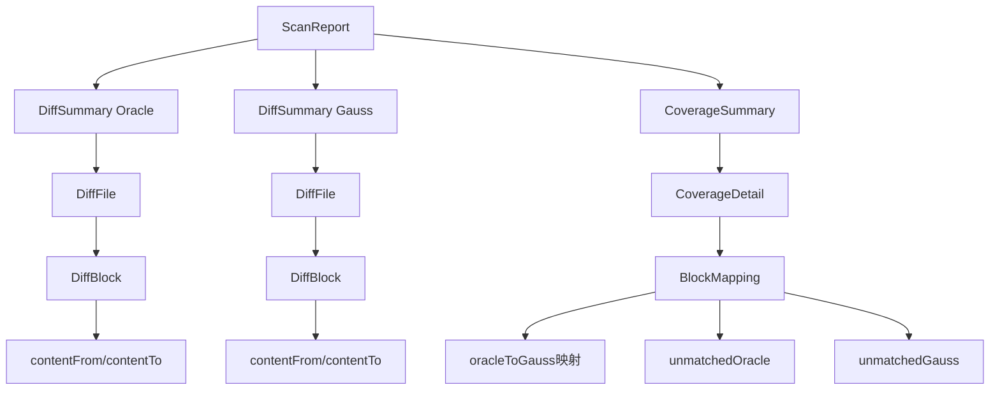

# 数据结构与召回率分析

## 遍历仓库后得到的数据结构

### 1. 核心数据结构关系图



### 2. 详细数据结构说明

#### ScanReport - 扫描报告总览
```java
class ScanReport {
    String taskId;                    // 任务唯一标识
    ScanMode mode;                   // 扫描模式（FULL/INCREMENTAL）
    String presetName;                // 预设配置名称
    DiffSummary oracleSummary;         // Oracle仓库差异汇总
    DiffSummary gaussSummary;          // Gauss仓库差异汇总
    CoverageSummary coverageSummary;    // 覆盖率分析结果
    Instant generatedAt;              // 生成时间
    
    // 内部索引（用于快速查找）
    Map<String, DiffFile> oracleIndex;     // 按文件路径索引Oracle文件
    Map<String, DiffFile> gaussIndex;      // 按文件路径索引Gauss文件
    Map<String, CoverageDetail> coverageIndex; // 按文件路径索引覆盖率
}
```

#### DiffSummary - 仓库差异汇总
```java
class DiffSummary {
    RepoConfig repoConfig;           // 仓库配置信息
    String repoPath;                 // 仓库路径
    String branchFrom;                // 起始分支
    String branchTo;                  // 目标分支
    String baseCommitId;              // 基础提交ID
    String targetCommitId;            // 目标提交ID
    DeltaType deltaType;              // 差异类型（DELTA_O/DELTA_G）
    List<DiffFile> diffFiles;        // 差异文件列表
}
```

#### DiffFile - 单个文件的差异信息
```java
class DiffFile {
    String relativePath;              // 文件相对路径
    List<DiffBlock> blocks;          // 该文件的所有差异块
    DiffType diffType;               // 差异类型（ADD/DELETE/MODIFY）
    DeltaType deltaType;             // 所属的仓库类型
}
```

#### DiffBlock - 代码块差异
```java
class DiffBlock {
    int startLineFrom;               // 原始起始行号
    int endLineFrom;                 // 原始结束行号
    int startLineTo;                 // 目标起始行号
    int endLineTo;                   // 目标结束行号
    String contentFrom;               // 原始代码内容
    String contentTo;                 // 目标代码内容
    DiffType type;                   // 差异类型
}
```

#### CoverageDetail - 单文件覆盖率详情
```java
class CoverageDetail {
    String filePath;                  // 文件路径
    double coverage;                  // 文件覆盖率（0-1）
    double matchedLines;              // 匹配的加权行数
    int totalLines;                   // 总行数
    List<DiffBlock> matchedBlocks;    // 已匹配的Oracle块
    List<DiffBlock> unmatchedBlocks;  // 未匹配的Oracle块
    
    // Strong模式特有字段
    double blockScore;                // 块得分
    boolean isCriticalMiss;           // 是否关键丢失
    int criticalMissCount;             // 关键丢失块数量
}
```

#### BlockMapping - 块间映射关系（核心）
```java
class BlockMapping {
    // 核心映射关系
    Map<DiffBlock, DiffBlock> oracleToGauss;     // Oracle块到Gauss块的映射
    Map<DiffBlock, Double> similarities;           // 映射的相似度分数
    
    // 未匹配块
    List<DiffBlock> unmatchedOracle;               // Oracle中未匹配的块
    List<DiffBlock> unmatchedGauss;                // Gauss中未匹配的块
    
    // 详细信息
    List<MatchDetail> matchDetails;                // 匹配详情列表
    
    // 计算方法
    double getCoverage();            // 块级别覆盖率 = 匹配数/Oracle总数
    int getMatchedCount();         // 匹配数量
    int getTotalOracleCount();      // Oracle总块数
    int getTotalGaussCount();      // Gauss总块数
}

class MatchDetail {
    DiffBlock oracleBlock;          // Oracle块
    DiffBlock gaussBlock;           // Gauss块
    double similarity;              // 相似度分数
}
```

## 块间匹配关系详解

### 1. 匹配关系类型

#### 完全匹配（1:1）
```java
// Oracle块A ↔ Gauss块X，相似度 > 0.85
oracleToGauss: {blockA: blockX}
similarities: {blockA: 0.92}
```

#### 未匹配Oracle块
```java
// Oracle块B在Gauss中无对应块
unmatchedOracle: [blockB, blockD, ...]
```

#### 未匹配Gauss块
```java
// Gauss块Y在Oracle中无对应块（可能是Gauss新增）
unmatchedGauss: [blockY, blockZ, ...]
```

### 2. 匹配质量评估

#### 相似度分数解读
- **0.85-1.0**: 高质量匹配，可直接认为是已迁移
- **0.6-0.85**: 中等匹配，需要人工确认
- **0.3-0.6**: 低质量匹配，可能需要LLM辅助判断
- **0.0-0.3**: 极低匹配，基本认为是未迁移

#### 覆盖率计算层次

##### 块级别覆盖率
```java
// 单个文件的块匹配情况
double blockCoverage = matchedBlocks.size() / (matchedBlocks.size() + unmatchedBlocks.size());
```

##### 文件级别覆盖率
```java
// 单个文件的加权覆盖率
double fileCoverage = matchedLines / totalLines;
// 其中 matchedLines = Σ(相似度 × 行数)
```

##### 仓库级别覆盖率
```java
// 整个仓库的加权覆盖率
double repoCoverage = totalMatchedLines / totalLines;
```

## 召回率分析

### 1. 块间召回率

#### 定义
**块间召回率** = 正确匹配的Oracle块数 / Oracle总块数

#### 计算方法
```java
// 基于相似度阈值的召回率
double calculateBlockRecall(double threshold) {
    int correctMatches = 0;
    for (Map.Entry<DiffBlock, DiffBlock> entry : oracleToGauss.entrySet()) {
        DiffBlock oracleBlock = entry.getKey();
        double similarity = similarities.get(oracleBlock);
        if (similarity >= threshold) {
            correctMatches++;
        }
    }
    return (double) correctMatches / getTotalOracleCount();
}

// 不同阈值的召回率示例
double recall85 = calculateBlockRecall(0.85);  // 严格匹配召回率
double recall60 = calculateBlockRecall(0.60);  // 宽松匹配召回率
```

#### 召回率分层分析
```java
class RecallAnalysis {
    double highQualityRecall;     // 相似度>0.85的召回率
    double mediumQualityRecall;    // 相似度0.6-0.85的召回率
    double lowQualityRecall;       // 相似度0.3-0.6的召回率
    double overallRecall;          // 整体召回率
    
    // 各层级的块数量统计
    int highQualityMatches;       // 高质量匹配块数
    int mediumQualityMatches;      // 中等质量匹配块数
    int lowQualityMatches;        // 低质量匹配块数
    int unmatchedBlocks;          // 未匹配块数
}
```

### 2. 文件召回率

#### 定义
**文件召回率** = 至少有一个匹配块的文件数 / Oracle中有变更的文件总数

#### 计算方法
```java
double calculateFileRecall(List<CoverageDetail> coverageDetails) {
    int filesWithMatches = 0;
    int totalOracleFiles = 0;
    
    for (CoverageDetail detail : coverageDetails) {
        if (detail.getMatchedBlocks().size() > 0) {
            filesWithMatches++;
        }
        totalOracleFiles++;
    }
    
    return (double) filesWithMatches / totalOracleFiles;
}
```

#### 文件状态分类
```java
enum FileStatus {
    MATCHED,        // 覆盖率 > 0.8，认为已完全迁移
    PARTIAL,        // 覆盖率 0.3-0.8，部分迁移
    ORACLE_ONLY,    // 覆盖率 < 0.3，基本未迁移
    GAUSS_ONLY,     // Gauss中新增，Oracle中无对应
    PENDING         // 待处理
}
```

### 3. 实际应用示例

#### 示例数据结构
```java
// 假设扫描结果示例
ScanReport report = ScanReport.builder()
    .taskId("task-123")
    .oracleSummary(DiffSummary.builder()
        .diffFiles(Arrays.asList(
            DiffFile.builder()
                .relativePath("com/example/service/UserService.java")
                .blocks(Arrays.asList(
                    DiffBlock.builder().contentFrom("oldMethod1").contentTo("newMethod1").build(),
                    DiffBlock.builder().contentFrom("oldMethod2").contentTo("newMethod2").build(),
                    DiffBlock.builder().contentFrom("oldMethod3").contentTo("newMethod3").build()
                ))
                .build()
        ))
        .build())
    .coverageSummary(CoverageSummary.builder()
        .details(Arrays.asList(
            CoverageDetail.builder()
                .filePath("com/example/service/UserService.java")
                .coverage(0.67)  // 2/3的块匹配
                .matchedLines(45.6)  // 加权匹配行数
                .totalLines(68)      // 总行数
                .matchedBlocks(Arrays.asList(block1, block2))  // 匹配的块
                .unmatchedBlocks(Arrays.asList(block3))       // 未匹配的块
                .build()
        ))
        .overallCoverage(0.67)
        .build())
    .build();
```

#### 块映射详情
```java
BlockMapping blockMapping = BlockMapping.builder()
    .oracleToGauss(Map.of(
        oracleBlock1, gaussBlock1,  // 相似度: 0.92
        oracleBlock2, gaussBlock2   // 相似度: 0.78
    ))
    .similarities(Map.of(
        oracleBlock1, 0.92,
        oracleBlock2, 0.78
    ))
    .unmatchedOracle(Arrays.asList(oracleBlock3))
    .unmatchedGauss(Arrays.asList(gaussBlock3))  // Gauss新增
    .matchDetails(Arrays.asList(
        new MatchDetail(oracleBlock1, gaussBlock1, 0.92),
        new MatchDetail(oracleBlock2, gaussBlock2, 0.78)
    ))
    .build();

// 召回率计算
double blockRecall = blockMapping.getCoverage();  // 0.67 (2/3)
double highQualityRecall = 0.5;  // 只有block1超过0.85阈值
double mediumQualityRecall = 0.5; // block2在0.6-0.85范围
```

## LLM辅助判断的应用点

### 1. 需要LLM判断的场景

#### 低相似度块（0.3-0.6）
```java
// 从unmatchedOracle中筛选可能语义匹配的块
List<DiffBlock> candidateBlocks = unmatchedOracle.stream()
    .filter(block -> {
        // 与Gauss中所有未匹配块计算基础相似度
        double maxSimilarity = calculateMaxSimilarity(block, unmatchedGauss);
        return maxSimilarity >= 0.3 && maxSimilarity < 0.6;
    })
    .collect(Collectors.toList());

// 这些候选块需要LLM进行语义判断
```

#### 结构重构场景
```java
// 检测可能的重构场景
class RefactoringCandidate {
    DiffBlock oracleBlock;
    List<DiffBlock> possibleGaussMatches;  // 可能分散到多个Gauss块中
    RefactoringType type;  // SPLIT, MERGE, REORDER, REFACTOR
}

// 识别重构候选
List<RefactoringCandidate> findRefactoringCandidates(BlockMapping mapping) {
    // 1. 一个Oracle块对应多个Gauss块的候选
    // 2. 多个Oracle块对应一个Gauss块的候选
    // 3. 内容相似但结构差异大的候选
}
```

### 2. LLM输入数据结构

#### 语义等价性判断输入
```java
class SemanticMatchRequest {
    String filePath;              // 文件路径
    DiffBlock oracleBlock;        // Oracle块内容
    List<DiffBlock> gaussCandidates; // Gauss候选块列表
    String context;               // 周围代码上下文
    Map<String, Object> metadata; // 元数据（行号、方法名等）
}

class SemanticMatchResponse {
    String bestMatchId;          // 最佳匹配的块ID
    double confidence;            // 置信度（0-1）
    boolean isSemanticallyEquivalent; // 是否语义等价
    String explanation;          // 解释说明
    RefactoringType refactoringType; // 重构类型（如适用）
}
```

#### 依赖关系分析输入
```java
class DependencyAnalysisRequest {
    String filePath;              // 文件路径
    DiffBlock oracleBlock;        // Oracle块
    List<DiffBlock> oracleContext; // Oracle上下文块
    List<DiffBlock> gaussContext;  // Gauss上下文块
    Map<String, List<String>> dependencies; // 依赖关系
}
```

### 3. 召回率提升策略

#### 分层召回率目标
```java
class RecallTargets {
    double highQualityTarget = 0.85;  // 高质量匹配目标召回率
    double mediumQualityTarget = 0.70;  // 中等质量匹配目标召回率
    double overallTarget = 0.90;        // 整体目标召回率
}

// LLM辅助后的预期召回率提升
class RecallImprovement {
    double baselineRecall;         // 基线召回率（仅传统算法）
    double llmAssistedRecall;      // LLM辅助后召回率
    double improvement;            // 提升幅度
    int additionalMatches;        // 额外匹配的块数
}
```

## 总结

通过现有的数据结构，你可以获得：

1. **完整的块映射关系**: [`BlockMapping`](backend/src/main/java/com/example/migratediff/domain/coverage/BlockMapping.java) 提供了Oracle到Gauss的详细映射
2. **多层级覆盖率**: 块级别、文件级别、仓库级别的覆盖率计算
3. **召回率分析**: 可以基于不同相似度阈值计算召回率
4. **LLM辅助点**: 低相似度块、重构场景、依赖关系分析

这些数据结构为你的代码迁移完整性检查提供了坚实的基础，特别是 [`BlockMapping.oracleToGauss`](backend/src/main/java/com/example/migratediff/domain/coverage/BlockMapping.java:25) 和 [`unmatchedOracle`](backend/src/main/java/com/example/migratediff/domain/coverage/BlockMapping.java:33) 字段直接回答了"哪些Oracle代码块未在Gauss中找到匹配"这一核心问题。