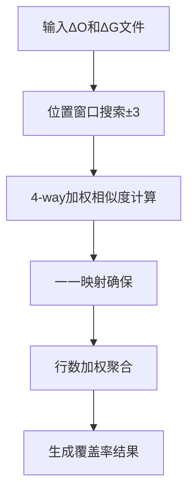
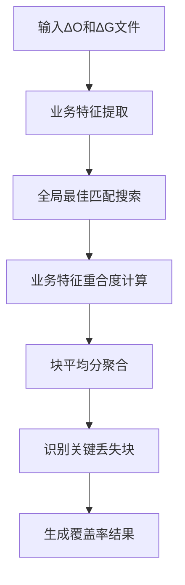

# 代码比较工具项目功能点总结

## 项目概述

这是一个基于Spring Boot的代码迁移差异分析平台，主要用于比较两个代码仓库（Oracle和Gauss）之间的差异，计算代码覆盖率，并生成迁移报告。

## 核心功能流程

### 1. 代码扫描与差异分析

#### 1.1 多策略扫描支持
- **BRANCH模式**: 传统分支间差异比较
- **SNAPSHOT模式**: 基于时间窗口的全仓库快照比较
- **RELEASE_AUTO模式**: 自动检测Release分支与主分支的差异

#### 1.2 扫描流程
1. **配置解析**: 通过预设配置或动态请求解析仓库配置
2. **仓库扫描**: 使用JGit库扫描指定时间范围内的代码变更
3. **差异解析**: 解析文件变更内容，生成DiffFile和DiffBlock结构
4. **结果存储**: 将扫描结果存储到内存和文件系统

### 2. 覆盖率计算与分析

#### 2.1 双算法支持
- **Legacy算法**: 基于行数加权的传统覆盖率计算
  - 使用位置窗口搜索进行块映射
  - 采用4-way加权相似度计算
  - 公式: `覆盖率 = Σ(相似度 × 行数) / 总行数`

- **Strong算法**: 基于业务特征锚点的强匹配算法
  - 提取业务强特征（字面量、驼峰命名、方法调用等）
  - 全局搜索最佳匹配，不限制位置窗口
  - 公式: `覆盖率 = Σ(BlockScores) / BlockCount`

#### 2.2 噪音处理机制
- **双Tokenization策略**: 匹配阶段保留完整信息，计算阶段过滤噪音
- **智能过滤**: 可配置跳过未匹配的纯噪音块（import-only、comment-only）

### 3. 迁移模板生成

#### 3.1 自动化迁移支持
- **模板生成**: 基于代码块差异自动生成迁移模板
- **决策分类**: 智能分类代码块（新增、修改、删除等）
- **模板应用**: 支持应用生成的迁移模板
- **回滚机制**: 提供迁移操作的回滚功能

### 4. 报表导出功能

#### 4.1 多格式导出
- **Excel导出**: 支持双Sheet结构（汇总页+详情页）
- **CSV导出**: 轻量级数据导出格式
- **异步导出**: 大数据量时的后台异步处理

#### 4.2 报表内容
- **覆盖率统计**: 文件级别和整体覆盖率数据
- **差异矩阵**: 文件状态（matched、oracle-only、gauss-only）
- **提交历史**: 文件的详细提交记录和作者统计
- **筛选功能**: 支持按状态、覆盖率、文件扩展名等筛选

### 5. 提交信息分析

#### 5.1 批量提交获取
- **仓库级别批量**: 一次性获取仓库所有文件提交历史
- **时间范围筛选**: 根据预设配置的时间范围过滤提交
- **作者统计**: 聚合分析提交者贡献度

#### 5.2 提交类型识别
- 自动识别提交类型（feature、bugfix、refactor等）
- 提交消息分析和分类
- 变更统计（添加/删除行数）

## 核心算法逻辑

### 1. 覆盖率计算算法

#### Legacy算法流程

#### Strong算法流程

### 2. 时间窗口扫描策略

#### RELEASE_AUTO模式逻辑
1. **Baseline选择**: master窗口内最早 → master窗口前最后 → 空结果
2. **EndCommit选择**: release分支最新 → master窗口内最晚 → 空结果
3. **差异执行**: 基于选定的两个提交点执行diff操作

### 3. 异步导出优化

#### 批量处理策略
- **仓库级别并行**: 多个仓库并行处理
- **文件级别批量**: 每个仓库内文件批量获取提交信息
- **内存优化**: 使用ConcurrentHashMap缓存tokenization结果

## 技术架构特点

### 1. 模块化设计
- **领域驱动**: 按业务领域划分模块（coverage、diff、migration、scan）
- **策略模式**: 支持多种算法和扫描策略的灵活切换
- **依赖注入**: 使用Spring的IoC容器管理组件依赖

### 2. 性能优化
- **缓存机制**: 多层缓存提高响应速度
- **异步处理**: 大数据量操作使用异步任务
- **批量操作**: 减少Git操作次数，提高效率

### 3. 扩展性设计
- **配置驱动**: 通过配置文件灵活调整行为
- **插件化算法**: 易于添加新的覆盖率算法
- **多存储支持**: 支持文件系统和数据库存储

## 主要API接口

### 扫描相关
- `POST /api/scan/full` - 全量扫描
- `POST /api/scan` - 增量扫描
- `POST /api/scan/detail` - 获取文件详情
- `GET /api/scan/presets` - 获取预设配置

### 迁移相关
- `POST /api/migrate/generate` - 生成迁移模板
- `POST /api/migrate/apply` - 应用迁移
- `POST /api/migrate/revert` - 回滚迁移

### 导出相关
- `POST /api/scan/report/aggregate` - 聚合报表导出
- `POST /api/scan/export/async/create` - 创建异步导出任务
- `GET /api/scan/export/async/status/{taskId}` - 查询导出状态

## 配置管理

### 预设配置系统
- 支持多组仓库配置预设
- 动态添加新的扫描配置
- 时间窗口和扫描策略灵活配置

### 算法配置
- 覆盖率算法选择（legacy/strong）
- 噪音过滤开关
- 相似度阈值配置

这个项目通过模块化设计和策略模式，实现了一个功能完整、性能优化的代码迁移差异分析平台，能够有效支持大规模代码库的比较和迁移工作。